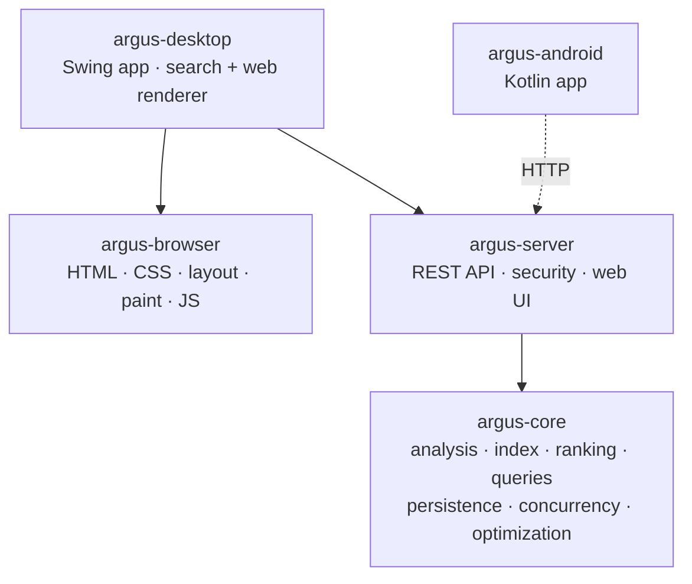

# Argus

Two hard systems, from scratch in Java, in one codebase:

- a **full-text search engine** — inverted index, BM25 ranking, a query DSL, durable storage with
  crash recovery, concurrency, and a hardened REST server; and
- a **browser rendering engine** — an HTML tokenizer, DOM, CSS cascade, box-model layout, a Java2D
  painter, and a tree-walking **JavaScript** interpreter with DOM bindings.

The engine has **zero third-party runtime dependencies** (only the JDK).

> **Honest scope.** The renderer draws *static* HTML and a practical subset of CSS, and runs a subset
> of JavaScript that reads and mutates the DOM. It is **not** Chrome — no flexbox/grid, images, web
> fonts, or framework-heavy single-page apps. The goal is depth of understanding, not feature parity.

[](../../actions/workflows/ci.yml)

---

## Features

### Engine — `argus-core`
- **Analysis:** tokenizer, stop-words, Porter stemmer, token positions
- **Inverted index:** postings with positions, term/field statistics, soft deletes
- **Ranking:** Okapi **BM25** (and a pluggable TF-IDF)
- **Queries:** term, boolean (`AND` / `OR` / `NOT`, minimum-should-match), exact **phrase**, **prefix**,
  and a recursive-descent **query-DSL parser** — e.g. `title:distributed AND body:"fault tolerant"`
- **Persistence:** binary codec with CRC32 integrity, immutable **segments**, a fsync'd
  **write-ahead log**, an atomic manifest, and **crash recovery**
- **Concurrency:** thread-safe writer, near-real-time snapshot search, parallel bulk indexing
- **Optimization:** from-scratch **simplex** linear-programming solver, **gradient descent**,
  **L-BFGS**, and **coordinate ascent** (the basis for learning-to-rank)

### Server — `argus-server`
- Dependency-free HTTP server: `POST /index`, `GET /search`, `POST /delete`, `POST /commit`,
  `GET /stats`, and an animated browser UI at `/`
- **Security:** API-key bearer auth (constant-time compare), per-IP rate limiting, OWASP response
  headers + nonce-based CSP, request-size limits, input validation, no error leakage

### Rendering engine — `argus-browser`
- **HTML:** a tolerant tokenizer (with raw-text `<script>` / `<style>`) and a stack-based tree builder → DOM
- **CSS:** a parser for selectors (type / class / id / compound + descendant) with **specificity**, and
  a **cascade** that resolves computed styles with inheritance and inline-style overrides
- **Layout:** a CSS **box-model** engine — block flow with the width / margin algorithm, and inline
  **line-breaking** with word wrap
- **Paint:** a display list rasterized with **Java2D** (headless-testable via `BufferedImage`)
- **JavaScript:** a hand-written **lexer, parser, and tree-walking interpreter** — closures, `this`,
  arrays, objects, `for` / `while` / `for-of`, and **DOM bindings** (`getElementById`,
  `querySelector`, `createElement`, `textContent`, `innerHTML`, `element.style`, …) so scripts mutate
  the page before it is painted
- **Networking:** fetches pages and `<link>` stylesheets over HTTP/HTTPS (scheme allow-list, size
  caps, timeouts; TLS validation stays on)

### Desktop app — `argus-desktop`
- A Swing application with two tabs: a **Search** tab (browser-style bar, back / forward / home,
  ranked result cards, index dialog, live stats, one-click embedded-server toggle) and a **Web** tab
  that fetches and renders live pages with the in-process `argus-browser` engine

### Android app — `argus-android`
- A native Kotlin client to the Argus server (built by CI into an APK)

---

## Architecture



---

## Build & test

Requires **JDK 17**.

```bash
mvn verify        # compiles all modules and runs the full test suite
```

## Run

**Server** (durable, on-disk index; UI at `http://localhost:8080`):

```bash
mvn -q -pl argus-desktop -am package -DskipTests
java -cp argus-desktop/target/argus-desktop-1.0.0.jar io.argus.server.ArgusServer 8080 argus-data
```

Set `ARGUS_API_KEY` to require a bearer token on write endpoints.

**Desktop app:**

```bash
java -jar argus-desktop/target/argus-desktop-1.0.0.jar
```

---

## REST API

| Method | Path | Body / Query | Returns |
|---|---|---|---|
| `POST` | `/index` | `{"id":"d1","title":"…","body":"…"}` | `{"docId":N}` |
| `GET`  | `/search` | `?q=…&field=body&k=10` | `{"total":N,"hits":[…]}` |
| `POST` | `/delete` | `{"field":"id","term":"d1"}` | `{"deleted":N}` |
| `POST` | `/commit` | — | `{"status":"ok"}` |
| `GET`  | `/stats` | — | `{"numDocs":N,"maxDoc":N,"generation":N}` |

Query syntax: `term`, `field:term`, `AND`/`OR`/`NOT`, `+required` / `-excluded`, `"exact phrase"`,
`prefix*`, and `( … )` grouping.

---

## Packaging & releases

Push a version tag to build native installers with `jpackage` (`.deb` / `.dmg` / Windows app-image)
plus a portable jar and the Android APK, and publish them all as a GitHub Release:

```bash
git tag v1.0.0 && git push --tags
```

Workflows: `ci.yml` (tests), `release.yml` (desktop installers), `android.yml` (APK).

---

## Tech

Java 17 · Maven (multi-module) · zero runtime dependencies in the engine · Swing + Java2D (desktop
and rendering) · Kotlin + Android SDK (mobile).

## License

MIT
